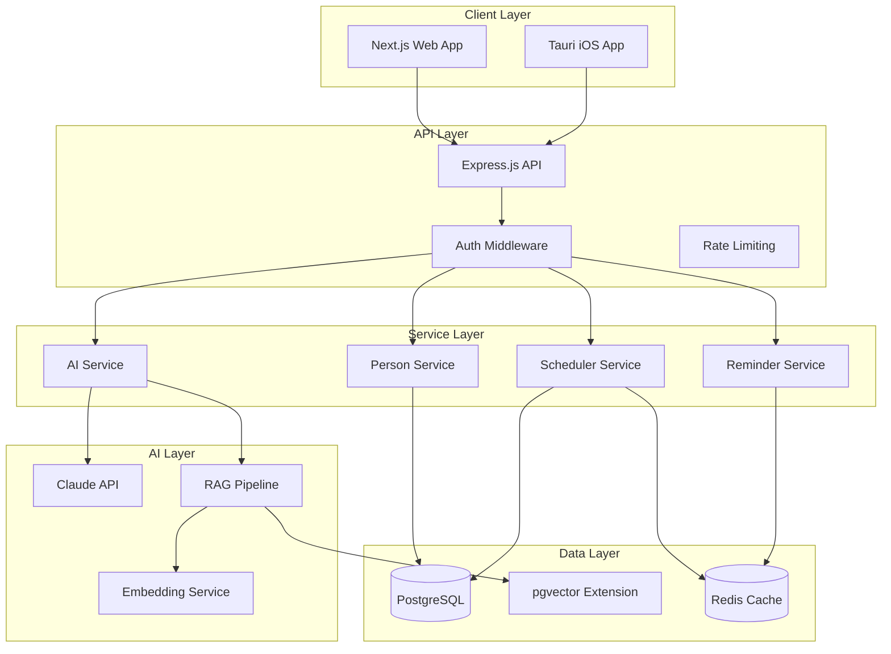
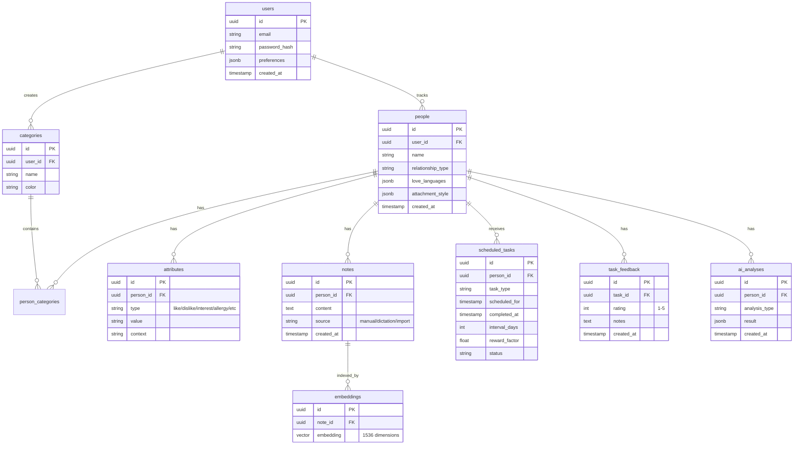
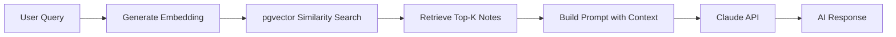

# Personal Relationship CRM - Technical Specification

## Architecture Overview




---

## 1. Tech Stack


| Layer | Technology |
| ----- | ---------- |


**Frontend:**

- Next.js 16 (App Router, React 19)
- Tailwind CSS v4
- Tauri 2.0 for iOS packaging
- React Query for data fetching
- Zustand for client state

**Backend:**

- Express.js with TypeScript (migrate from JS)
- tRPC for type-safe API (optional, can use REST)
- Zod for validation

**Database:**

- PostgreSQL 16 with pgvector extension
- Drizzle ORM (type-safe, lightweight)
- Redis for caching/job queues

**AI:**

- Anthropic Claude (claude-sonnet-4-20250514) for LLM
- Voyage AI or OpenAI for embeddings (Claude doesn't do embeddings)
- RAG with pgvector similarity search

**Infrastructure:**

- Docker Compose for local dev
- BullMQ for job scheduling (reminders, tasks)

---

## 2. Database Schema




Key files to create:

- `[packages/db/schema.ts](packages/db/schema.ts)` - Drizzle schema definitions
- `[packages/db/migrations/](packages/db/migrations/)` - Database migrations

---

## 3. Core Features Implementation

### 3.1 Person Management

```typescript
// apps/backend/src/services/person.service.ts
interface Person {
  id: string;
  name: string;
  relationshipType: 'romantic' | 'family' | 'friend' | 'professional';
  categories: string[];
  attributes: Attribute[];
  loveLanguages?: LoveLanguageProfile;
  attachmentStyle?: AttachmentStyle;
}

interface Attribute {
  type: 'like' | 'dislike' | 'interest' | 'allergy' | 'preference';
  value: string;
  context?: string; // "loves Italian food for date nights"
}
```

### 3.2 AI/RAG Pipeline




Implementation approach:

- Store note embeddings in pgvector (1536 dimensions)
- On query: embed query, find similar notes, inject as context
- Claude generates contextual responses

Key file: `[apps/backend/src/services/ai.service.ts](apps/backend/src/services/ai.service.ts)`

```typescript
class AIService {
  async query(userId: string, personId: string, situation: string) {
    // 1. Get relevant context via RAG
    const context = await this.ragService.search(personId, situation);
    
    // 2. Build system prompt with person data + context
    const systemPrompt = this.buildPrompt(person, context, situation);
    
    // 3. Call Claude
    return this.claude.messages.create({
      model: 'claude-sonnet-4-20250514',
      system: systemPrompt,
      messages: [{ role: 'user', content: situation }]
    });
  }
}
```

### 3.3 Variable Reward Scheduling

Based on behavioral psychology - randomized intervals keep engagement high.

```typescript
// apps/backend/src/services/scheduler.service.ts
class SchedulerService {
  calculateNextDate(task: Task, feedback?: number): Date {
    const baseInterval = task.intervalDays;
    
    // Apply variance (e.g., +/- 30%)
    const variance = 0.3;
    const randomFactor = 1 + (Math.random() * 2 - 1) * variance;
    
    // Adjust based on feedback (1-5 scale)
    const feedbackMultiplier = feedback 
      ? 0.8 + (feedback / 5) * 0.4  // 0.8x to 1.2x
      : 1;
    
    const adjustedInterval = baseInterval * randomFactor * feedbackMultiplier;
    
    return addDays(new Date(), Math.round(adjustedInterval));
  }
}
```

Features:

- Blackout dates (holidays, busy periods)
- Force dates (anniversaries, birthdays)
- Feedback loop adjusts intervals
- Task types: flowers, date night, notes, gifts, activities

### 3.4 Input Methods

**Dictation:**

- Web Speech API for browser
- Whisper API for accuracy (optional)
- Real-time transcription to notes

**Text Import:**

- Parse conversations (WhatsApp, iMessage exports)
- Extract entities and sentiments
- Auto-categorize into attributes

```typescript
// apps/backend/src/services/import.service.ts
async parseTextImport(text: string, personId: string) {
  const prompt = `Extract structured information from this text...`;
  const extraction = await this.aiService.extract(text, prompt);
  
  // Create attributes and notes from extraction
  await this.personService.addAttributes(personId, extraction.attributes);
  await this.notesService.create(personId, text, 'import');
}
```

### 3.5 AI Analyzers

Each analyzer uses Claude with specific prompts + person data:

- **Love Language Analyzer**: Maps to 5 love languages with percentages
- **Attachment Style Analyzer**: Secure/anxious/avoidant/disorganized
- **Conflict Analyzer**: Patterns, triggers, resolution strategies
- **Apology Drafter**: Contextual apologies based on situation + history

Key file: `[apps/backend/src/services/analyzers/](apps/backend/src/services/analyzers/)`

---

## 4. API Structure

```
apps/backend/src/
├── index.ts                 # Express app setup
├── routes/
│   ├── auth.routes.ts       # Login, register, refresh
│   ├── people.routes.ts     # CRUD for people
│   ├── notes.routes.ts      # Notes management
│   ├── tasks.routes.ts      # Scheduled tasks
│   ├── ai.routes.ts         # AI queries, analyzers
│   └── import.routes.ts     # Text/voice import
├── services/
│   ├── person.service.ts
│   ├── scheduler.service.ts
│   ├── ai.service.ts
│   ├── rag.service.ts
│   ├── import.service.ts
│   └── analyzers/
│       ├── love-language.ts
│       ├── attachment-style.ts
│       └── conflict.ts
├── middleware/
│   ├── auth.ts
│   └── rate-limit.ts
└── jobs/
    ├── reminder.job.ts      # BullMQ job for reminders
    └── embedding.job.ts     # Background embedding generation
```

---

## 5. Frontend Structure

```
apps/web/app/
├── (auth)/
│   ├── login/page.tsx
│   └── register/page.tsx
├── (dashboard)/
│   ├── layout.tsx           # Sidebar, nav
│   ├── page.tsx             # Dashboard home
│   ├── people/
│   │   ├── page.tsx         # People list
│   │   └── [id]/page.tsx    # Person detail
│   ├── tasks/page.tsx       # Task management
│   ├── assistant/page.tsx   # AI chat interface
│   └── settings/page.tsx
├── components/
│   ├── PersonCard.tsx
│   ├── AttributeEditor.tsx
│   ├── VoiceInput.tsx       # Dictation component
│   ├── ChatInterface.tsx    # AI assistant
│   └── TaskScheduler.tsx
└── lib/
    ├── api.ts               # API client
    └── hooks/               # React Query hooks
```

---

## 6. Tauri iOS Integration

Tauri 2.0 supports iOS. The approach:

1. Build Next.js as static export (`output: 'export'`)
2. Tauri wraps the static files
3. Native features via Tauri plugins (notifications, etc.)

```
apps/mobile/
├── src-tauri/
│   ├── Cargo.toml
│   ├── tauri.conf.json
│   └── src/
│       └── main.rs
├── src/                     # Can share components with web
└── package.json
```

Considerations:

- Use `next export` for static generation
- API calls to hosted backend
- Push notifications via Tauri plugin

---

## 7. Authentication

Simple JWT-based auth (can migrate to better solution later):

- `POST /auth/register` - Create account
- `POST /auth/login` - Get JWT tokens
- `POST /auth/refresh` - Refresh access token
- Passwords hashed with bcrypt
- Access token (15min) + Refresh token (7d)

---

## 8. Key Dependencies to Add

**Backend (`apps/backend/package.json`):**

```json
{
  "@anthropic-ai/sdk": "^0.30.0",
  "drizzle-orm": "^0.35.0",
  "pg": "^8.13.0",
  "bullmq": "^5.0.0",
  "bcrypt": "^5.1.0",
  "jsonwebtoken": "^9.0.0",
  "zod": "^3.23.0",
  "ioredis": "^5.4.0"
}
```

**Shared (`packages/db/package.json`):**

```json
{
  "drizzle-orm": "^0.35.0",
  "drizzle-kit": "^0.28.0",
  "pg": "^8.13.0"
}
```

---

## 9. Development Phases

**Phase 1 - Foundation:**

- Set up PostgreSQL + Drizzle schema
- Migrate backend to TypeScript
- Implement auth
- Basic person CRUD

**Phase 2 - Core Features:**

- Notes with embeddings
- RAG pipeline with Claude
- AI assistant chat interface
- Basic analyzers

**Phase 3 - Scheduling:**

- Variable reward scheduler
- Task management UI
- In-app reminders
- Feedback system

**Phase 4 - Input Methods:**

- Voice dictation
- Text import parsing
- Bulk data entry

**Phase 5 - Mobile:**

- Tauri iOS setup
- Static export configuration
- Push notifications

**Phase 6 - Polish:**

- Vacation planner
- Restaurant picker
- Advanced analyzers
- Habit/ritual builder

